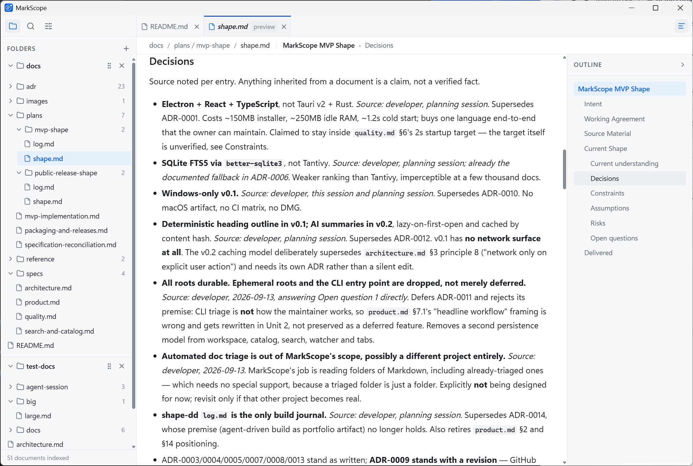
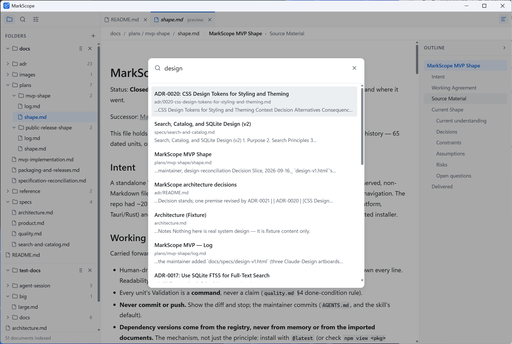
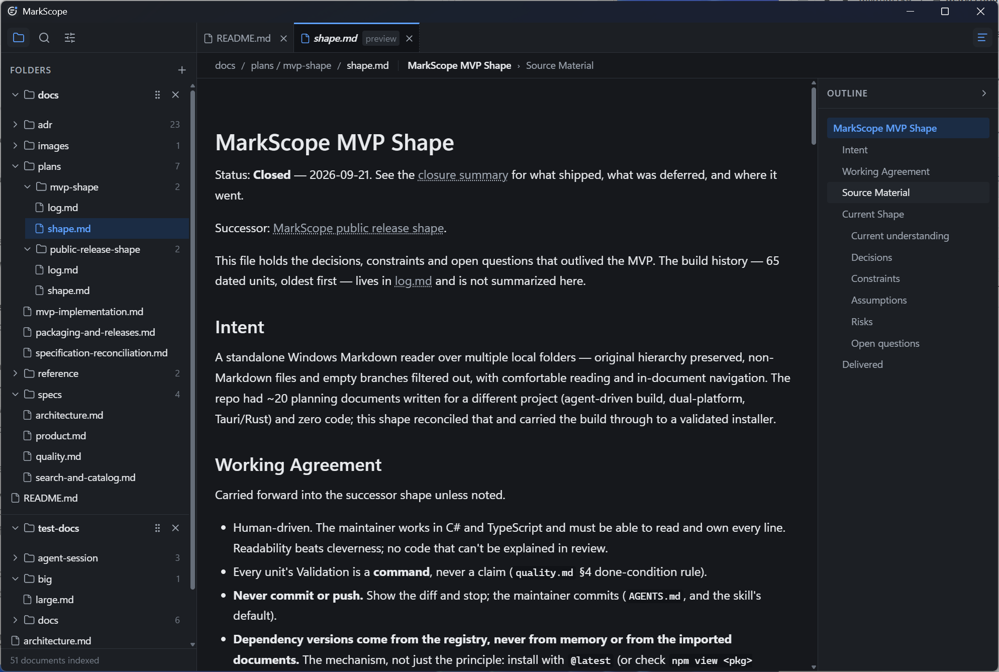

# MarkScope

A desktop Markdown reader for several local folders at once — and the complete record of how an AI agent and a human built it.

MarkScope points at folders you already have (repositories, notes, plan directories) and shows the Markdown in them in its original hierarchy, with everything that isn't Markdown filtered out. It is a reader, not an editor. Windows only, and it makes no network requests of any kind.



## What it does

Every item below is implemented and covered by the test suite or a recorded manual check.

**Browsing**

- Add any number of folders through the native picker. They persist across restarts and can be dragged into whatever order you like.
- The tree keeps each folder's real hierarchy, showing `.md` and `.markdown` files only. Branches with no Markdown anywhere beneath them are pruned, so a deep source tree collapses to just its documentation.
- Hidden directories and common build output are skipped: `.git`, `node_modules`, `bin`, `obj`, `dist`, `build`, `.next`, `coverage`, `.vs`, `TestResults` — and, currently, any directory literally named `ignored`, which is a leftover from a test fixture and too generic a name to be hardcoded. The list is not configurable yet.

**Reading**

- GitHub-flavoured Markdown, sanitised before rendering, with syntax-highlighted code fences.
- Mermaid diagrams render as SVG, themed from the app's own colour tokens.
- Images resolve relative to the document, through the same trusted-folder boundary as everything else.
- A heading outline rail tracks your scroll position and jumps to any section; the breadcrumb shows the file path and the section you are currently in.

**Tabs and state**

- Single-click previews a file in one reusable tab; double-click pins it. VS Code's model.
- Open tabs, the active tab, each tab's scroll position, every folder's expanded state, the window size and the theme all survive a restart.

**Search**

- Full-text search across every indexed document (SQLite FTS5), opened with `Ctrl+F`. Arrow keys to move, `Enter` to open, `Esc` to close.




**Appearance**

- Follow the system theme, or force light or dark. Both themes are contrast-checked to WCAG AA.




## What it does not do

This is v0.1 and the list is deliberately short of a lot of things.

- **No editing.** Reading only.
- **No file watching.** Changes on disk are picked up when the app restarts, not while it is running.
- **Search is one ranked list.** No scope filter, no match highlighting, no separate file/heading/content results.
- **Most of Settings is a stub.** Appearance and About are real; Folders, Search & index and Keyboard shortcuts are visible but disabled.
- **Tabs can't be reordered or pinned**, and there is no keyboard loop for moving between files.
- **Large documents freeze the app.** A 5 MB Markdown file takes roughly nine seconds to parse, twice, with the UI blocked throughout. Ordinary documents are unaffected; this is measured and tracked, not unknown.
- **Windows only.** No macOS or Linux build.
- **No AI features.** A heading outline is deterministic and computed locally; summaries are a v0.2 idea, not a shipped feature.
- **No release, no code signing, no auto-update.** Build from source; see below.

## Running it

**There is no download.** v0.1 publishes no binary anywhere — no release, no installer to grab, signed or otherwise ([ADR-0009](docs/adr/0009-github-releases-for-distribution-and-updates.md)). Build it yourself:

```bash
git clone https://github.com/mikrum159/markscope.git
cd markscope
npm install
npm run dev          # run in development
npm run dist         # build dist/markscope-0.1.0-setup.exe
```

Developed and verified on Windows 11 with Node 26.5.1 and npm 12.0.2. `npm run dist` is there if you want a local installer; it is unsigned, so Windows SmartScreen will warn about an unknown publisher on first run.

### Two things `npm install` may tell you

**Electron's postinstall may be blocked** by npm's install-script allowlist (`npm warn install-scripts`). Run `npm install-scripts approve electron esbuild` and install again. If `node_modules/electron/dist` is still empty afterwards, the `extract-zip` step has silently no-opped — unzip the cached `electron-v<version>-win32-x64.zip` from `%LOCALAPPDATA%\electron\Cache` into `node_modules/electron/dist` by hand and put the path to `electron.exe` in `node_modules/electron/path.txt`.

**`better-sqlite3` will appear in the same warning, and should stay unapproved.** It ships a working prebuilt binary for `win32-x64` inside its own package, so it works with the script blocked. Approving it makes npm run `node-gyp rebuild`, which needs a Python toolchain and — when that fails — deletes the working module. If you approve it by accident, remove it from `allowScripts` and reinstall.

## How it was built

The application was written by an AI agent (Claude) working with one human maintainer, using a workflow called shape-driven development: rough intent, a compact living "shape" document, and one reviewable unit of work at a time, each agreed before building and recorded after.

The record is in the repository and is the part worth reading:

- **[The build log](docs/plans/mvp-shape/log.md)** — 65 dated units, oldest first. Every one names what changed, what was validated and how, what surprised, and what it deliberately left alone. It includes the units that failed: a manual check that came back "tested and doesn't work", root-caused the same session to a defect in an _earlier_ slice, fixed with a regression test that was then verified to fail against the pre-fix code.
- **[The MVP shape](docs/plans/mvp-shape/shape.md)** — the closed shape the app was built from. Every decision carries its source and date, and reversals name what they supersede.
- **[The current shape](docs/plans/public-release-shape/shape.md)** — what is being worked on now.
- **[Architecture decisions](docs/adr/README.md)** — 21 ADRs. Several are superseded; those records are kept with a pointer to their successor rather than rewritten, so the reasoning that turned out to be wrong is still legible. [ADR-0021](docs/adr/0021-publish-the-repository-and-its-build-record.md) is the decision to publish this record at all, and is explicit that the log is published because it exists rather than written because it would be published.

Two honest notes about that record. It was written as the work happened, not reconstructed afterwards — which is why some of it is unflattering. And it is a record of _one_ project by _one_ maintainer; it is evidence of how this worked here, not a claim about how agent-assisted development works generally.

## Repository layout

```
src/main/        Electron main process — filesystem, SQLite, IPC handlers
src/preload/     The renderer's entire view of the main process
src/renderer/    React UI
docs/specs/      Product, architecture, search and quality specifications
docs/adr/        Architecture decision records
docs/plans/      Shape files and build logs
test-docs/       Markdown fixture tree used by tests and manual checks
```

## Development

```bash
npm run typecheck && npm run lint && npm test   # the gate; 159 tests
npm run build                                   # compile without packaging
npm run format                                  # prettier
```

[CONTRIBUTING.md](CONTRIBUTING.md) describes the branch and review workflow. [AGENTS.md](AGENTS.md) holds the working rules the agent follows.

## License

[MIT](LICENSE).
