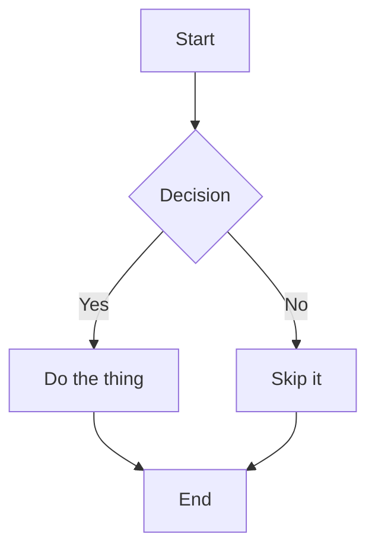

# Mermaid Fixture

This document has one valid diagram and one intentionally broken
diagram, so the preview's Mermaid handling can be checked for both
the happy path and a non-crashing fallback.

## Valid diagram



## Broken diagram

```mermaid
flowchart TD
  A[Start -->> B[[This is not valid Mermaid syntax
```

The rest of the page should still render even though the diagram
above does not.
